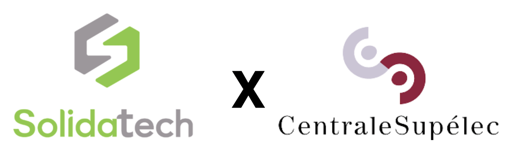
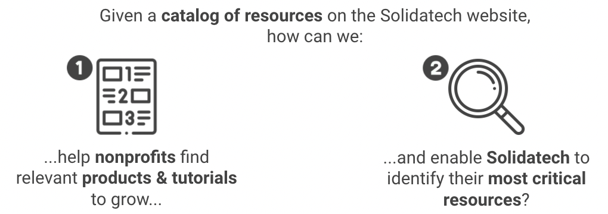
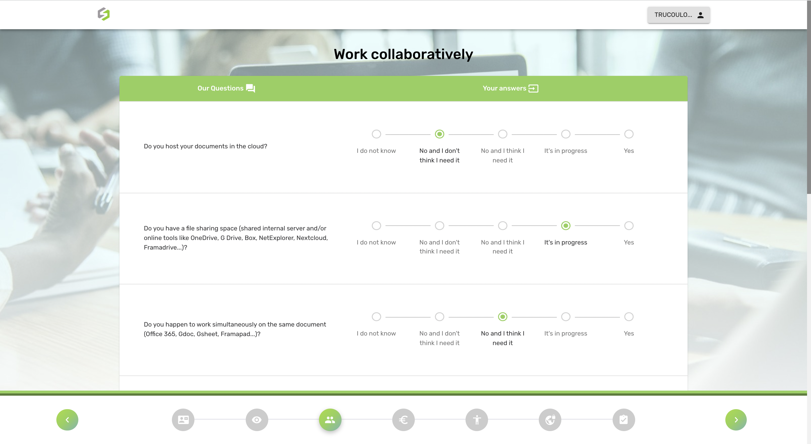

# Recommending resources to NGOs with a web app

  

## :dart: Description & objective

Solidatech is a French tech4good NGO that sells software and hardware solutions to other French NGOs at a fair price. Given the multitude of products and tutorials available on Solidatech’s website, it is easy for new associations to get lost on the platform if they do not know precisely what they want. In 2020, three CentraleSupélec students and I went on to build a resource recommender system for Solidatech based on a form to help new customers identify their needs and find ways to fill in the gaps.

In a few words:

  

## :bulb: Methodology

  

## :file_folder: Repository organization

## :wrench:	Techs used

## :warning: Disclaimer
