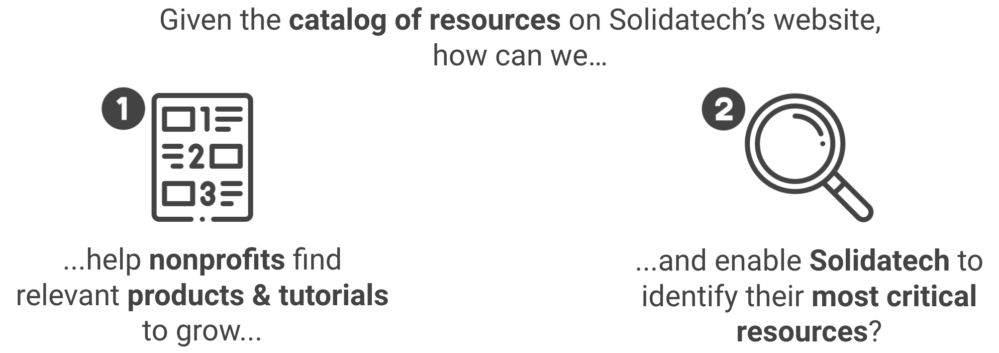

# Recommending resources to NGOs with a web app

<p align="center">
  <a href="#"></a>
</p>


## :dart: Description & objective

Solidatech is a French tech4good NGO that sells software and hardware solutions to other French NGOs at a fair price. Given the multitude of products and tutorials available on Solidatech’s website, it is easy for new associations to get lost on the platform if they do not know precisely what they want. In 2020, three CentraleSupélec students and I went on to build a resource recommender system for Solidatech based on a form to help new customers identify their needs and find ways to fill in the gaps.

In a few words:
<p align="center">
  <a href="#"></a>
</p>


## :bulb: Methodology
<p align="center">
  <a href="https://diagnostic-numerique.solidatech.fr/"></a>
</p>

To solve our problem, we developed a **web application now deployed at https://diagnostic-numerique.solidatech.fr/ (300+ users)**. Here is a **dummy account** to explore a bit more the web app:
> - **email:** ```jane.doe1982@gmail.com```
> - **password:** ```ezpassword```
As the web app is in French, we recommend using the Google Translate functionality on Google Chrome to translate the pages in English.

Typical user journey for a client:
> 1. user connects to the web app from Solidatech's website
> 2. user creates or connects to an account and lands on home page (=> use the credentials provided above)
> 3. user fills the questionaire divided in 7 sections (answers are then sent to the backend of the web app to compute personalized recommendations based on a scoring algorithm and editable rules defined by Solidatech)
> 4. user is redirected to a dashboard gathering most relevant product & tutorial suggestions.

In the case of the dummy account provided above, its affiliated organization has:
> :pinched_fingers: mediocre network animation \
> :+1: very good visibility on the web \
> :+1: very good collaborative work ethic \
> :-1: poor project funding \
> :pinched_fingers: mediocre human and financial resources management \
> :-1: poor securization of web resources and compliance with regulations \
> :+1: very good management of digital transformation strategy \


## :file_folder: Repository organization


## :wrench:	Techs used


## :warning: Disclaimer
